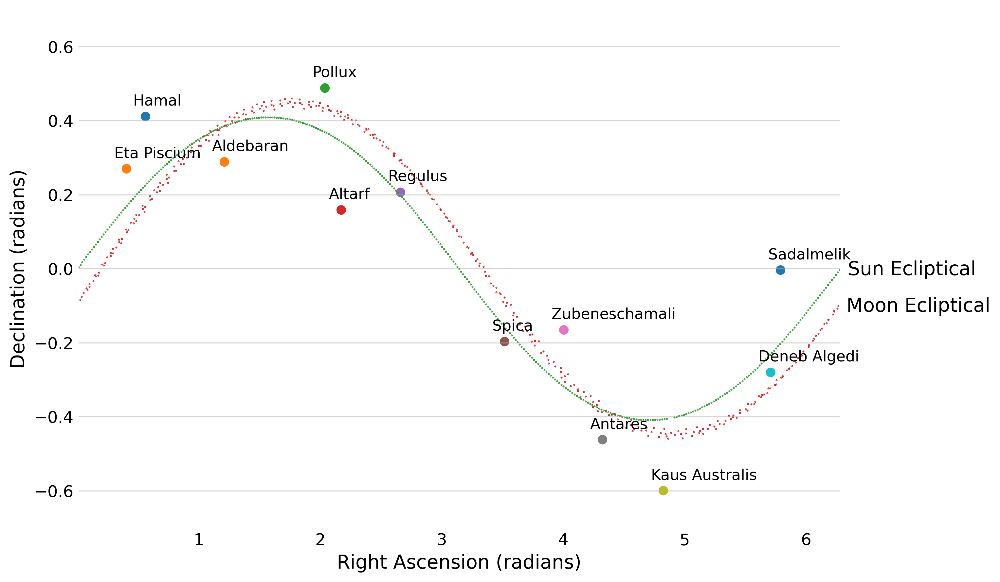

# Pseudo-random numbers with pseudoscience

rng is so complicated! Why cant we have a horoscopic, vibe-y way of calculating a random number? Why cant rng be based on the position of the sun, and the zodiac signs? Well lucky you, you're on the right repo! 

This is the code to churn through some astrology, and make an app you can deploy to Azure. You can access the API here: http://andrew-rng.azurewebsites.net/

## The code

Whatever, I dont know. We are finding random numbers using the position of the sun? Does it matter? who cares.

Well, anyway, we follow a few quick steps:

 * find the Zodiac sign the sun/ moon are in, and their position. This will only update daily - so you only get one random number a day! make the most of it! (interstingly, the moon goes through the zodiac houses super fast, over and over again in the year)
 * Man, turns out starsigns are complicated. This is all based on a real astronomy python library, and therefore acknowledge the existence of ophiuchus, which astrologers dont accept. If the sun or moon are in ophiuchus, we are gonna just swap it with Scorpio
 * For the constellation, pick out the brightest star (found in the json)
 * calculate the distance, in radians, between this star and the sun or moon
 * then we do something to merge all these numbers together? thats it.

this will give you a randomish number. Heres a plot that starts to describe all this data:

(please dont use this to actually do rng. but you also should cause it would be very funny. pls cite me.)

